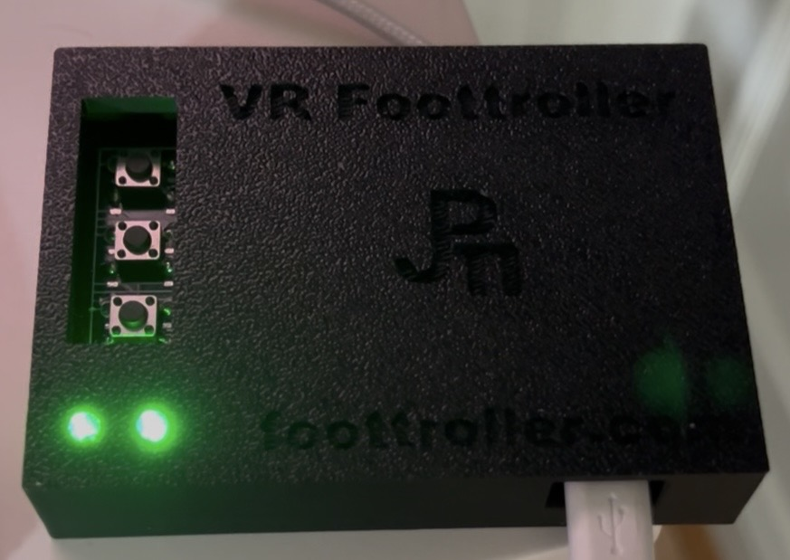

<!--
SPDX-FileCopyrightText: Copyright (c) 2025-2026 NVIDIA CORPORATION & AFFILIATES. All rights reserved.
SPDX-License-Identifier: Apache-2.0
-->

In this version of IsaacTeleop, a plugin has been added for Foottroller (www.foottroller.com) that enables natural, hands-free locomotion control!
The plugin reads Foottroller’s raw inputs as gamepad axes and buttons and converts them into full locomotion commands via retargeting. 
You get smooth velocity control (X & Y), rotation, and robot height adjustment — all through intuitive foot gestures.
Now you can walk, strafe, turn, and adjust height naturally with your feet, keeping both hands completely free for manipulation, grasping, and other tasks.
Check out the demo video below to see how to use Foottroller for Robot locomotion control.

Foottroller Isaac Teleop: Natural Foot Gesture for hands-free locomotion (guide with slow motion)
https://youtu.be/qGGIyA1QBXM

How to use:
Install Isaac Sim 6.0
Install IsaacLab 3.0.0 beta-2

Clone this repo and 
build IsaacTeleop:

    bash
    
    rm -rf build install
    
    cmake -B build -DISAAC_TELEOP_PYTHON_VERSION=3.12       # use the matching python version for IsaacLab
    
    cmake --build build --target clang_format_fix
    
    cmake --build build
    
    cmake --install build

Install the new build to IsaacLab:
    
    uv pip install "isaacteleop[retargeters,cloudxr,ui]" --find-links=./install/wheels/ --reinstall

Run the foottroller locomotion example to verify Foottroller inputs and retargeter function.
    
    Start cloudXR:  https://nvidia.github.io/IsaacTeleop/main/getting_started/quick_start.html
    
    In a terminal run cloudXR server
    
        python -m isaacteleop.cloudxr

    Connect an XR headset

    Open a new terminal and source the CloudXR environment variables:
        source ~/.cloudxr/run/cloudxr.env
    
    
    Connect Foottroller control box to the Linux PC via Bluetooth.
    Set Foottroller control box to Dev mode by pressing the button closest to the two LED lights until both LED lights are on. This allows raw Foottroller measurements sent to the PC.

    
    Set gamepad to zero dead zones for Foottroller axes. 
    
    Install jstest-gtk if not installed.
    
        sudo apt install jstest-gtk

    
    Run Foottroller plugin in the terminal
        In build/src/plugins/foottroller/, run ./foottroller_plugin /dev/input/js0  # make sure /dev/input/js0 is the device path for Foottroller 
        
    Open another new terminal and source the CloudXR environment variables:
        source ~/.cloudxr/run/cloudxr.env
    Run the example
        python examples/teleop/python/foottroller_locomotion_example.py
    Generate locomotion controls with foot gestures using foot gestures as shown in the demo video
    

# Isaac Teleop

**The unified framework for high-fidelity ego-centric and robotics data collection.**

---

## Overview

**Isaac Teleop**: The unified standard for high-fidelity egocentric and robot data collection.
It is designed to address the data bottleneck in robot learning by streamlining device integration;
standardizing high-fidelity human demo data collection; and foster device & data interoperability.

## Key Features

- Unified stack for sim & real teleoperation
- Standardized device interface
- Flexible retargeting framework

See the [Ecosystem](https://nvidia.github.io/IsaacTeleop/main/overview/ecosystem.html) page for supported robotics stacks, devices, and retargeting details.

### Teleoperation Use Cases

- Currently supported use cases
  - Use XR headsets for gripper / tri-finger hand manipulation
  - Use XR headsets with gloves for dex-hand manipulation
  - Seated full body loco-manipulation (Homie)
  - Tracking based full body loco-manipulation (Sonic)
  - Egocentric data collection (aka “no-robot”)
- Upcoming use cases
  - Teleoperate using only non-XR devices (e.g. gamepad, Gello, haply, etc.)
  - Teleoperate cloud based robotics simulations
  - Remote teleoperation with camera streaming to the desktop
  - Remote teleoperation with immersive camera streaming to XR headsets

## Quick Start

### Documentation

Our [documentation page](https://nvidia.github.io/IsaacTeleop) provides everything you need to get started, including detailed tutorials and step-by-step guides. Follow these links to learn more:

- [Architecture](https://nvidia.github.io/IsaacTeleop/main/overview/architecture.html)
- [Quick installation steps](https://nvidia.github.io/IsaacTeleop/main/getting_started/quick_start.html)
- [How to build from source](https://nvidia.github.io/IsaacTeleop/main/getting_started/build_from_source.html)

### Install & Run Isaac Lab

Isaac Teleop is design to work side by side with [NVIDIA Isaac Lab](https://github.com/isaac-sim/IsaacLab) starting with Isaac Lab [3.0 Beta release](https://github.com/isaac-sim/IsaacLab/releases/tag/v3.0.0-beta).

To get started, please refer to Isaac Lab's [Installation](https://isaac-sim.github.io/IsaacLab/develop/source/setup/installation/index.html) guide for more details. Then follow the [CloudXR teleoperation in Isaac Lab](https://isaac-sim.github.io/IsaacLab/develop/source/how-to/cloudxr_teleoperation.html) to get started with Teleoperation in Sim.
